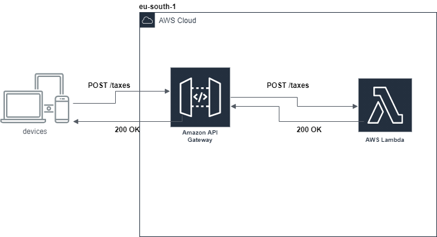

# Tax Serverless Java
## Exercise 
This problem requires some kind of input to generate sales taxes amount. You are free to implement any mechanism for feeding input into your solution. You should provide sufficient evidence that your solution is complete by, as a minimum, indicating that it works correctly against the supplied data.  
## PROBLEM: SALES TAXES
**Basic sales tax** is applicable at a rate of **10%** on all goods, **except** books, food, and medical products that are exempt. **Import duty** is an additional sales tax applicable on all imported goods at a rate of 5%, with no exemptions.
When I purchase items I receive a receipt which lists the name of all the items and their price (including tax), finishing with the total cost of the items, and the total amounts of sales taxes paid. The rounding rules for sales tax are that for a tax rate of n%, a shelf price of p contains (np/100 rounded up to the nearest 0.05) amount of sales tax.
Write an application that prints out the receipt details for these shopping baskets...

```
INPUT:

Input 1:
2 book at 12.49
1 music CD at 14.99
1 chocolate bar at 0.85

Input 2:
1 imported box of chocolates at 10.00
1 imported bottle of perfume at 47.50

Input 3:
1 imported bottle of perfume at 27.99
1 bottle of perfume at 18.99
1 packet of headache pills at 9.75
3 box of imported chocolates at 11.25

OUTPUT

Output 1:
2 book: 24.98
1 music CD: 16.49
1 chocolate bar: 0.85
Sales Taxes: 1.50
Total: 42.32

Output 2:
1 imported box of chocolates: 10.50
1 imported bottle of perfume: 54.65
Sales Taxes: 7.65
Total: 65.15

Output 3:
1 imported bottle of perfume: 32.19
1 bottle of perfume: 20.89
1 packet of headache pills: 9.75
3 imported box of chocolates: 35.55
Sales Taxes: 7.90
Total: 98.38
```

## Assumptions
There are some assumptions I made for the final solution:
1. The imported products must have the **"imported"** word in the product name
2. The food, medical and book products are filtered based on the presence in the product name of:
   1. **"chocolate"** for food product
   2. **"pills"** for medical product
   3. **" book"** for book product
3. The request/response is in **JSON** format

## Architecture Cloud
First of all, I decided to implement a **serverless** solution on **AWS** cloud. The choice was driven by the fact that the service is stateless (no database involved), and the small memory footprint of the application mitigate the cold start of the lambda function.  
So the lambda function is the most cost/effective solution for the application.  


The **API gateway** has public access and the public endpoint is:
https://6s2osc5ck6.execute-api.eu-south-1.amazonaws.com/dev

The API for the tax calculation is under:
**POST** https://6s2osc5ck6.execute-api.eu-south-1.amazonaws.com/dev/taxes

### Infrastructure as code
The implementation of the cloud infrastructure (api gateway + lambda) is handled by the [Serverless](https://www.serverless.com/) framework.
All the IaC is written in the serverless.yml:
```yaml
# Welcome to Serverless!
# Basic serverless setup for taxes exercise with api gateway and lamda_proxy integration

service: taxes-exercise


# Serverless version 2
frameworkVersion: '2'

# Provider aws, stage dev, region eu-south-1 (Milan)
provider:
  name: aws
  runtime: java8
  lambdaHashingVersion: 20201221
  stage: dev
  region: eu-south-1


# Package information
package:
  artifact: 'target/${self:service}-${self:provider.stage}.jar'

# Calculate taxes post function with the related path
functions:
  calculateTaxes:
    handler: com.claranet.controller.CalculateTaxesHandler
    events:
      - http:
          path: /taxes
          method: post
```
### CI/CD pipeline via Github action
The CI/CD pipeline is handled by the Github action divided in two jobs:
1. **build_and_test** job: Compile and testing the application
2. **deploy** job: Deploy the application with Serverless framework to AWS.

The action is triggered on every push on **main** branch.

# Application
All the application is written in java, so the lambda function is in java code. The handler of the **POST** request is in the class **CalculateTaxesHandler.java**.  
As mentioned above the request/response is in JSON format.  
**Request format** is an array of products.  
**Request 1**:
```json
[
  {
    "quantity": 2,
    "price": "12.49",
    "productName": "book"
  },
  {
    "quantity": 1,
    "price": "14.99",
    "productName": "music CD"
  },
  {
    "quantity": 1,
    "price": "0.85",
    "productName": "chocolate bar"
  }
]
```
**Response format** is an array of products with tax price calculated, total price and total taxes.  
**Response 1**
```json
{
    "productWithTaxes": [
        {
            "quantity": 2,
            "price": "24.98",
            "productName": "book"
        },
        {
            "quantity": 1,
            "price": "16.49",
            "productName": "music CD"
        },
        {
            "quantity": 1,
            "price": "0.85",
            "productName": "chocolate bar"
        }
    ],
    "totalPrice": "42.32",
    "taxSales": "1.50"
}
```
## Testing
For testing the application you can use directly the public API endpoint mentioned above:  
**Examples 1**  
For the **input 1** of the problem you can call the service via curl:  
``` curl -X POST https://6s2osc5ck6.execute-api.eu-south-1.amazonaws.com/dev/taxes -d '[{"quantity": 2 , "price": "12.49", "productName":"book"},{"quantity":1, "price": "14.99", "productName": "music CD"}, {"quantity":1, "price":"0.85","productName": "chocolate bar"}]' ```

And the **Response** will be:  
``` {"productWithTaxes":[{"quantity":2,"price":"24.98","productName":"book"},{"quantity":1,"price":"16.49","productName":"music CD"},{"quantity":1,"price":"0.85","productName":"chocolate bar"}],"totalPrice":"42.32","taxSales":"1.50"} ```

### Local testing
You can also local testing the application if you clone this project. Keep in mind there some prerequisites to meet: 
1. Npm and Node installed for the Serverless framework
2. Install servlerless cli
3. maven and jdk 8 for the java application

Secondly you have to build the application with:  
``` mvn clean package ```  
and lastly:  
``` serverless invoke local -f calculateTaxes -d '[{"quantity": 2 , "price": "12.49", "productName":"book"},{"quantity":1, "price": "14.99", "productName": "music CD"}, {"quantity":1, "price":"0.85","productName": "chocolate bar"}]' ```
